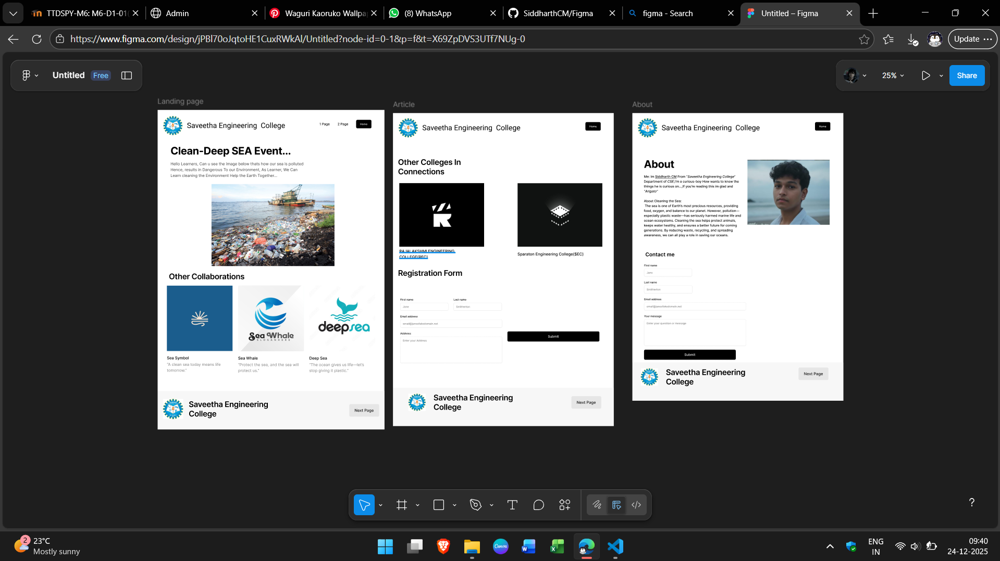

# Ex08 Event Registration Web Application
## Date:24.12.25

## AIM:
To design, develop and deploy a web application for event registration using Figma UI tool.

## UI DESIGN TOOL:
Figma

## DESIGN STEPS:

### Step 1:
Use frames to represent screens or sections.

### Step 2:
Add column grids for consistent spacing and alignment.

### Step 3:
Insert shapes, text, buttons, and icons.

### Step 4:
Use Auto Layout for flexible, responsive design.

### Step 5:
Define color, text, and effect styles globally for consistency.

### Step 6:
Name layers logically and group related elements.

### Step 6:
Link frames to show navigation or interactions.

### Step 7:
Select the specific frame while generating code using Anima plugin.

## CODE:
```
index.html:
<!DOCTYPE html>
<html>
  <head>
    <meta name="viewport" content="width=device-width, initial-scale=1" />
    <meta charset="utf-8" />
    <link rel="stylesheet" href="globals.css" />
    <link rel="stylesheet" href="styleguide.css" />
    <link rel="stylesheet" href="style.css" />
  </head>
  <body>
    <div class="about">
      <div class="copy">
        <div class="text-wrapper">About</div>
        <p class="paragraph">
          <span class="span">Me: Im </span>
          <span class="text-wrapper-2">Siddharth CM</span>
          <span class="span"> From “</span>
          <span class="span">Saveetha Engineering College</span>
          <span class="span">” Department of </span>
          <span class="span">CSE</span>
          <span class="span"
            >,I’m a curious-boy How wants to know the things he is curious on...,If you’re reading this im glad and
            “</span
          >
          <span class="span">Arigato”<br /></span>
          <span class="span"
            ><br />About Cleaning the Sea:
 The sea is one of Earth’s most precious resources, providing food, oxygen,
            and balance to our planet. However, pollution—especially plastic waste—has seriously harmed marine life and
            ocean ecosystems. Cleaning the sea helps protect animals, keeps water healthy, and ensures a better future
            for coming generations. By reducing waste, recycling, and spreading awareness, we can all play a role in
            saving our oceans.</span
          >
        </p>
      </div>
      
      <div class="form">
        <div class="input">
          <div class="div">First name</div>
          <div class="field"><div class="label">Jane</div></div>
        </div>
        <div class="input-2">
          <div class="div">Last name</div>
          <div class="field"><div class="label">Smitherton</div></div>
        </div>
        <div class="input-3">
          <label class="div" for="input-1">Email address</label>
          <input class="label-wrapper" placeholder="email@janesfakedomain.net" type="email" id="input-1" />
        </div>
        <div class="input-4">
          <div class="div">Your message</div>
          <input class="label-wrapper" placeholder="Enter your question or message" type="number" />
        </div>
        <button class="button"><div class="text-wrapper-3">Submit</div></button>
      </div>
      <div class="heading"><div class="text-wrapper-4">Contact me</div></div>
      <div class="navigation">
        <button class="items">
          <button class="div-wrapper"><div class="text-wrapper-5">Home</div></button>
        </button>
        <div class="saveetha-engineering">Saveetha Engineering&nbsp;&nbsp;College</div>
        
      </div>
      <div class="section">
        <div class="text-wrapper-6">Saveetha Engineering College</div>
        
        <div class="buttons">
          <button class="button-2"><div class="text-wrapper-7">Next Page</div></button>
        </div>
      </div>
    </div>
  </body>
</html>

global.css:

@import url("https://cdnjs.cloudflare.com/ajax/libs/meyer-reset/2.0/reset.min.css");
* {
  -webkit-font-smoothing: antialiased;
  box-sizing: border-box;
}
html,
body {
  margin: 0px;
  height: 100%;
}
/* a blue color as a generic focus style */
button:focus-visible {
  outline: 2px solid #4a90e2 !important;
  outline: -webkit-focus-ring-color auto 5px !important;
}
a {
  text-decoration: none;
}

style.css:

.about {
  background-color: #ffffff;
  overflow: hidden;
  width: 100%;
  min-width: 1296px;
  min-height: 1769px;
  position: relative;
}

.about .copy {
  display: flex;
  flex-direction: column;
  width: 624px;
  align-items: flex-start;
  gap: var(--variable-collection-spacing-s);
  position: absolute;
  top: 275px;
  left: 71px;
}

.about .text-wrapper {
  position: relative;
  align-self: stretch;
  margin-top: -1.00px;
  font-family: var(--title-font-family);
  font-weight: var(--title-font-weight);
  color: #000000;
  font-size: var(--title-font-size);
  letter-spacing: var(--title-letter-spacing);
  line-height: var(--title-line-height);
  font-style: var(--title-font-style);
}

.about .paragraph {
  position: relative;
  align-self: stretch;
  font-family: var(--body-text-font-family);
  font-weight: var(--body-text-font-weight);
  color: #000000;
  font-size: var(--body-text-font-size);
  letter-spacing: var(--body-text-letter-spacing);
  line-height: var(--body-text-line-height);
  font-style: var(--body-text-font-style);
}

.about .span {
  font-weight: var(--body-text-font-weight);
  font-family: var(--body-text-font-family);
  font-style: var(--body-text-font-style);
  letter-spacing: var(--body-text-letter-spacing);
  line-height: var(--body-text-line-height);
  font-size: var(--body-text-font-size);
}

.about .text-wrapper-2 {
  font-weight: var(--body-text-font-weight);
  text-decoration: underline;
  font-family: var(--body-text-font-family);
  font-style: var(--body-text-font-style);
  letter-spacing: var(--body-text-letter-spacing);
  line-height: var(--body-text-line-height);
  font-size: var(--body-text-font-size);
}

.about .whatsapp-image {
  position: absolute;
  top: 288px;
  left: 707px;
  width: 505px;
  height: 399px;
  aspect-ratio: 1.27;
  object-fit: cover;
}

.about .form {
  display: flex;
  flex-wrap: wrap;
  width: 43.47%;
  align-items: flex-start;
  gap: var(--variable-collection-spacing-SM);
  position: absolute;
  top: 925px;
  left: 5.56%;
}

.about .input {
  width: 295px;
  height: 80px;
  display: flex;
  flex-direction: column;
  align-items: flex-start;
  gap: 8px;
  position: relative;
}

.about .div {
  position: relative;
  align-self: stretch;
  margin-top: -1.00px;
  font-family: var(--small-text-font-family);
  font-weight: var(--small-text-font-weight);
  color: #000000;
  font-size: var(--small-text-font-size);
  letter-spacing: var(--small-text-letter-spacing);
  line-height: var(--small-text-line-height);
  font-style: var(--small-text-font-style);
}

.about .field {
  display: flex;
  align-items: flex-start;
  gap: 8px;
  padding: 12px 16px;
  position: relative;
  flex: 1;
  align-self: stretch;
  width: 100%;
  flex-grow: 1;
  background-color: #ffffff;
  border-radius: 8px;
  border: 1px solid;
  border-color: #dfdfdf;
  box-shadow: var(--button-shadow);
}

.about .label {
  position: relative;
  flex: 1;
  margin-top: -1.00px;
  font-family: var(--small-text-font-family);
  font-weight: var(--small-text-font-weight);
  color: #828282;
  font-size: var(--small-text-font-size);
  letter-spacing: var(--small-text-letter-spacing);
  line-height: var(--small-text-line-height);
  font-style: var(--small-text-font-style);
}

.about .input-2 {
  width: 297px;
  height: 80px;
  display: flex;
  flex-direction: column;
  align-items: flex-start;
  gap: 8px;
  position: relative;
}

.about .input-3 {
  width: 626px;
  height: 80px;
  margin-right: -62.60px;
  display: flex;
  flex-direction: column;
  align-items: flex-start;
  gap: 8px;
  position: relative;
}

.about .label-wrapper {
  padding: 12px 16px;
  position: relative;
  align-self: stretch;
  width: 100%;
  flex-grow: 1;
  background-color: #ffffff;
  border-radius: 8px;
  border: 1px solid;
  border-color: #dfdfdf;
  box-shadow: var(--button-shadow);
  flex: 1;
  margin-top: -1.00px;
  font-family: var(--small-text-font-family);
  font-weight: var(--small-text-font-weight);
  color: #828282;
  font-size: var(--small-text-font-size);
  letter-spacing: var(--small-text-letter-spacing);
  line-height: var(--small-text-line-height);
  font-style: var(--small-text-font-style);
}

.about .input-4 {
  width: 626px;
  height: 194px;
  margin-right: -62.60px;
  display: flex;
  flex-direction: column;
  align-items: flex-start;
  gap: 8px;
  position: relative;
}

.about .button {
  all: unset;
  box-sizing: border-box;
  display: flex;
  justify-content: center;
  padding: 16px 32px;
  flex: 1;
  flex-grow: 1;
  background-color: #000000;
  align-items: center;
  gap: 8px;
  position: relative;
  border-radius: 8px;
  box-shadow: var(--button-shadow);
}

.about .text-wrapper-3 {
  position: relative;
  display: flex;
  align-items: center;
  justify-content: center;
  width: fit-content;
  margin-top: -1.00px;
  font-family: var(--body-text-font-family);
  font-weight: var(--body-text-font-weight);
  color: #ffffff;
  font-size: var(--body-text-font-size);
  letter-spacing: var(--body-text-letter-spacing);
  line-height: var(--body-text-line-height);
  white-space: nowrap;
  font-style: var(--body-text-font-style);
}

.about .heading {
  display: flex;
  flex-direction: column;
  width: 624px;
  align-items: flex-start;
  gap: var(--variable-collection-spacing-s);
  position: absolute;
  top: 845px;
  left: 80px;
}

.about .text-wrapper-4 {
  position: relative;
  align-self: stretch;
  margin-top: -1.00px;
  font-family: "Inter-SemiBold", Helvetica;
  font-weight: 600;
  color: #000000;
  font-size: 32px;
  letter-spacing: 0;
  line-height: 48px;
}

.about .navigation {
  position: absolute;
  width: 100%;
  top: 0;
  left: 0;
  height: 182px;
  background-color: #ffffff;
}

.about .items {
  all: unset;
  box-sizing: border-box;
  display: inline-flex;
  align-items: center;
  justify-content: flex-end;
  gap: var(--variable-collection-spacing-m);
  position: absolute;
  top: 56px;
  right: 80px;
}

.about .div-wrapper {
  all: unset;
  box-sizing: border-box;
  display: inline-flex;
  justify-content: center;
  padding: 14px 24px;
  flex: 0 0 auto;
  background-color: #000000;
  align-items: center;
  gap: 8px;
  position: relative;
  border-radius: 8px;
  box-shadow: var(--button-shadow);
}

.about .text-wrapper-5 {
  position: relative;
  display: flex;
  align-items: center;
  justify-content: center;
  width: fit-content;
  margin-top: -1.00px;
  font-family: var(--small-text-font-family);
  font-weight: var(--small-text-font-weight);
  color: #ffffff;
  font-size: var(--small-text-font-size);
  letter-spacing: var(--small-text-letter-spacing);
  line-height: var(--small-text-line-height);
  white-space: nowrap;
  font-style: var(--small-text-font-style);
}

.about .saveetha-engineering {
  position: absolute;
  top: 73px;
  left: 180px;
  width: 714px;
  height: 35px;
  display: flex;
  align-items: center;
  justify-content: center;
  font-family: var(--m3-display-medium-font-family);
  font-weight: var(--m3-display-medium-font-weight);
  color: #000000;
  font-size: var(--m3-display-medium-font-size);
  letter-spacing: var(--m3-display-medium-letter-spacing);
  line-height: var(--m3-display-medium-line-height);
  white-space: nowrap;
  font-style: var(--m3-display-medium-font-style);
}

.about .saveetha-logo {
  top: 32px;
  left: 35px;
  width: 118px;
  height: 118px;
  position: absolute;
  aspect-ratio: 1;
}

.about .section {
  position: absolute;
  top: 1533px;
  left: -60px;
  width: 1440px;
  height: 236px;
  background-color: #f7f7f7;
}

.about .text-wrapper-6 {
  position: absolute;
  top: 32px;
  left: calc(50.00% - 454px);
  width: 625px;
  font-family: "Inter-SemiBold", Helvetica;
  font-weight: 600;
  color: #000000;
  font-size: 48px;
  letter-spacing: -0.96px;
  line-height: normal;
}

.about .img {
  top: 37px;
  left: 112px;
  width: 106px;
  height: 106px;
  object-fit: cover;
  position: absolute;
  aspect-ratio: 1;
}

.about .buttons {
  display: flex;
  width: 273px;
  align-items: center;
  justify-content: flex-end;
  gap: 24px;
  position: absolute;
  top: 32px;
  right: 176px;
}

.about .button-2 {
  all: unset;
  box-sizing: border-box;
  display: inline-flex;
  padding: 20px 32px;
  flex: 0 0 auto;
  background-color: #e6e6e6;
  align-items: center;
  gap: 8px;
  position: relative;
  border-radius: 8px;
  box-shadow: var(--button-shadow);
}

.about .text-wrapper-7 {
  position: relative;
  display: flex;
  align-items: center;
  justify-content: center;
  width: fit-content;
  margin-top: -1.00px;
  font-family: "Inter-Medium", Helvetica;
  font-weight: 500;
  color: #000000e6;
  font-size: 24px;
  letter-spacing: 0;
  line-height: 36px;
  white-space: nowrap;
}

styleguide.css:
:root {
  --title-font-family: "Inter", Helvetica;
  --title-font-weight: 700;
  --title-font-size: 64px;
  --title-letter-spacing: -1.28px;
  --title-line-height: normal;
  --title-font-style: normal;
  --body-text-font-family: "Inter", Helvetica;
  --body-text-font-weight: 500;
  --body-text-font-size: 20px;
  --body-text-letter-spacing: 0px;
  --body-text-line-height: 150%;
  --body-text-font-style: normal;
  --small-text-font-family: "Inter", Helvetica;
  --small-text-font-weight: 500;
  --small-text-font-size: 16px;
  --small-text-letter-spacing: 0px;
  --small-text-line-height: 150%;
  --small-text-font-style: normal;
  --m3-display-medium-font-family: "Roboto", Helvetica;
  --m3-display-medium-font-weight: 400;
  --m3-display-medium-font-size: 45px;
  --m3-display-medium-letter-spacing: 0px;
  --m3-display-medium-line-height: 52px;
  --m3-display-medium-font-style: normal;
  --button-shadow: 0px 1px 2px 0px rgba(0, 0, 0, 0.05);
  --colors-text-text-default: var(--colors-text-default-default);
  --variable-collection-spacing-s: 24px;
  --variable-collection-spacing-m: 48px;
  --variable-collection-spacing-SM: 32px;
}

```


## OUTPUT:



## RESULT:
The program to design, develop and deploy a web application for event registration using Figma UI tool is completed successfully.
